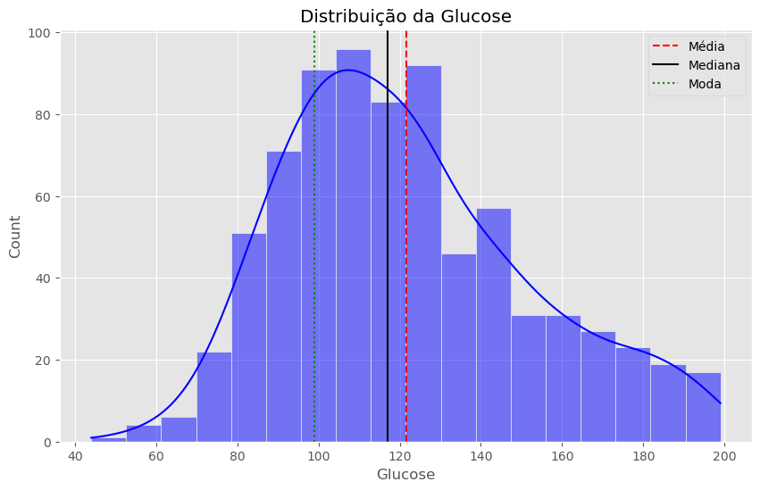
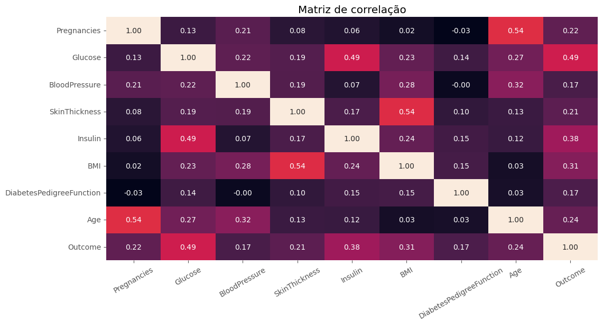
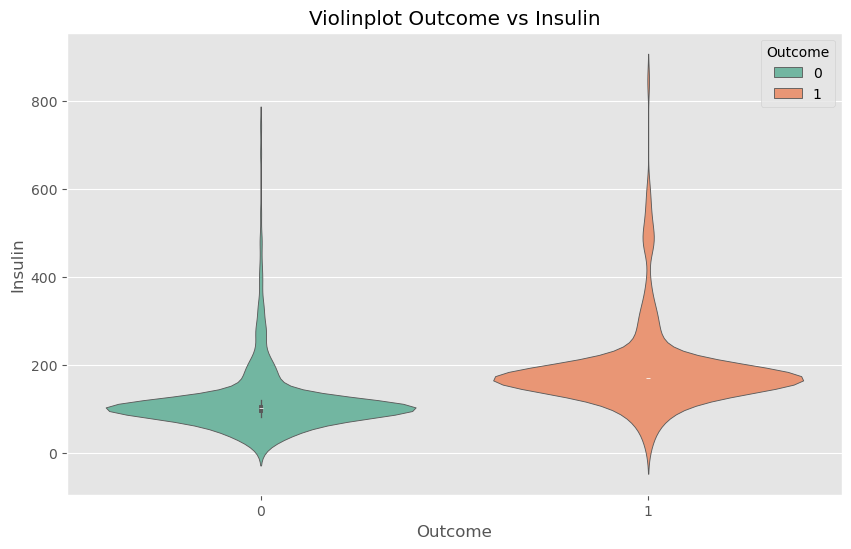
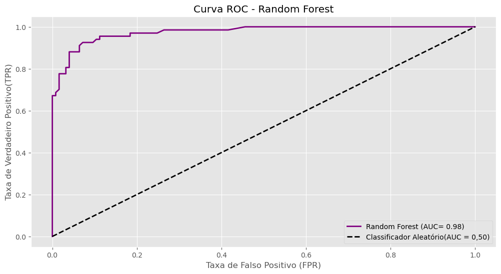
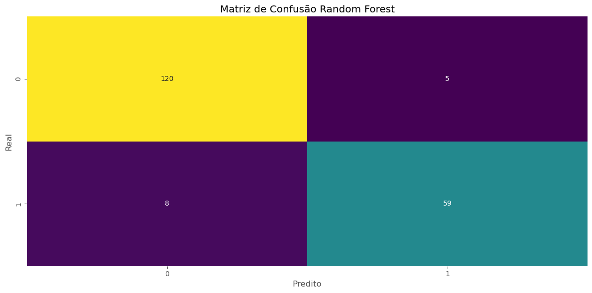

# Análise Preditiva de Diabetes — Pima Indians Dataset

---

## 📘 Visão Geral

Este projeto desenvolve modelos de **Machine Learning** para **detecção de diabetes**, utilizando o [Pima Indians Diabetes Database](https://www.kaggle.com/datasets/uciml/pima-indians-diabetes-database).

O foco está em **minimizar falsos negativos**, priorizando **sensibilidade (recall)** e métricas balanceadas — fundamentais em diagnósticos médicos.

---

## 🔬 Metodologia

### 🧹 Pré-processamento
- Identificação e tratamento de **valores inválidos (zeros mascarados)**.  
- Imputação estatística com base no comportamento das variáveis.  
- Tratamento diferenciado da variável **`Insulin`** por grupo de desfecho.  
- Escalonamento das variáveis com **StandardScaler**.  
- Divisão dos dados em **conjuntos de treino e teste estratificados**.

### 📊 Análise Exploratória
- Visualização de distribuições e assimetria das variáveis.  
- Análise de correlações entre fatores clínicos e o desfecho (diabetes).  
- Uso de **boxplots** e **violinplots** para avaliar o impacto de variáveis no *outcome*.  

> Exemplo de visualizações:
>
>   
*Distribuição da glicose por classe de diabetes.*
>   
*Correlação entre variáveis clínicas.*
> 
*Distribuição da insulina conforme o outcome.*  

### 🤖 Modelagem
Foram testados três algoritmos de classificação supervisionada:
- **Regressão Logística**  
- **Decision Tree**  
- **Random Forest**

Os modelos foram avaliados pelas seguintes métricas:  
**Acurácia Balanceada**, **Recall**, **F1-score**, **AUC-ROC** e **Log-loss**.

---

## 🧾 Resultados

| Modelo | Acurácia Balanceada | Recall | F1-score | AUC-ROC | Log-loss |
|--------|----------|--------|----------|----------|-----------|
| Logistic Regression | 0.74 | 0.56 | 0.66 | 0.88 | 0.41 |
| Decision Tree | 0.89 | 0.85 | 0.87 | 0.96 | 0.55 |
| **Random Forest**  | **0.92** | **0.88** | **0.90** | **0.97** | **0.23** |

> **Random Forest** apresentou o melhor desempenho geral, com ótimo equilíbrio entre sensibilidade e precisão, além de menor log-loss — indicando previsões mais confiáveis.

>   
*curva ROC do Random Forest.*
> 
*Matriz de Confusão do Random Forest.*

---

## 💡 Principais Insights

- **Glucose** e **BMI** são os preditores mais relevantes para o diagnóstico.  
- A variável **Insulin** mostra padrões distintos entre classes, justificando tratamento separado.  
- O **dataset é desbalanceado**, o que reforça a importância de métricas sensíveis à classe minoritária.  
- A **idade** não é um fator isolado, mas potencializa risco quando combinada com outras variáveis.  
---

## 📈 Próximos Passos

- Testar outros algoritmos de classificação, como **K-Nearest Neighbors (KNN)** e **Gradient Boosting**.  
- Aplicar **validação cruzada (k-fold)** para maior robustez dos resultados.  

---

## 🛠️ Tecnologias

- **Linguagem:** Python 3.10+
- **Análise:** Pandas
- **Visualização:** Matplotlib, Seaborn
- **Machine Learning:** Scikit-learn
- **Ambiente:** Google Colab / Jupyter Notebook 

---

## 👤 Autor

**Vitor Santos**  
🔗 [LinkedIn](https://www.linkedin.com/in/vitor-e-s-santos/) · ✉️ vitore.santos@hotmail.com  

